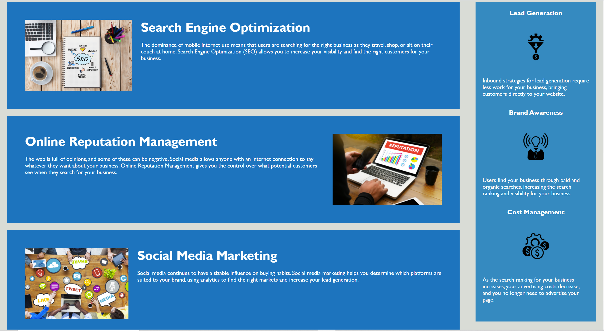

# Homework 1 - semantic tagging

 

## Objective

Revised existing HTML codes to use semantic tags where appropriate.  I took out almost all of the < div > tags and replaced them with the proper tags. I added the "alt" tag to images. I updated the css file to reflect the changes in the semantic tags that would affect the file. Last I consolidated some of the repeated css elements.

## Screen Shot

 <!-- You should have a brief description of your application/repo/work as well as a link to your deployed application and a screenshot. -->

Below is a link to the deployed application:
 
file:///C:/Users/willi/Documents/bootcamp/homework/hw-1/index.html